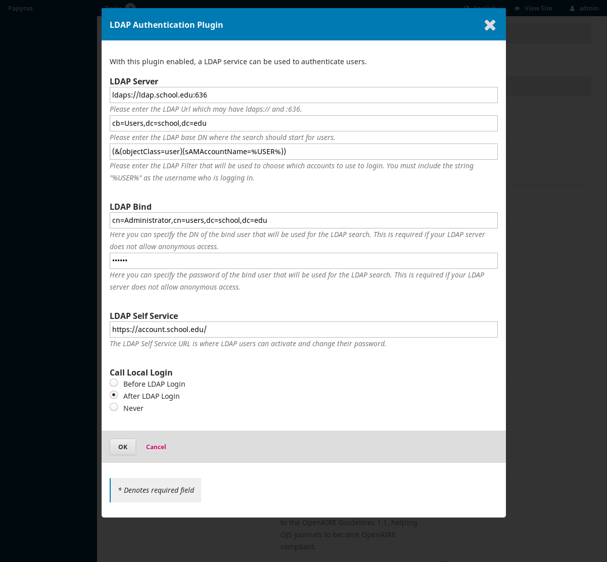

# ojs_ldap_plugin
LDAP Authorization Plugin for OJS

# Installing
1. Clone to `plugins/generic/ldap` folder of OJS 3.

  ```bash
  cd plugins/generic
  git clone https://github.com/shemgp/ojs_ldap_plugin.git ldap
  ```
2. Enable in global site settings.
3. Set settings in global site settings.  (Note: works in `ldaps://` and `:636` or will always use `tls`).

**Sample Settings**




# Notes
* Need to use `ldaps` or `tls`.
* Source is modified from the [Shibboleth Authorization Plugin](https://github.com/pkp/shibboleth).
